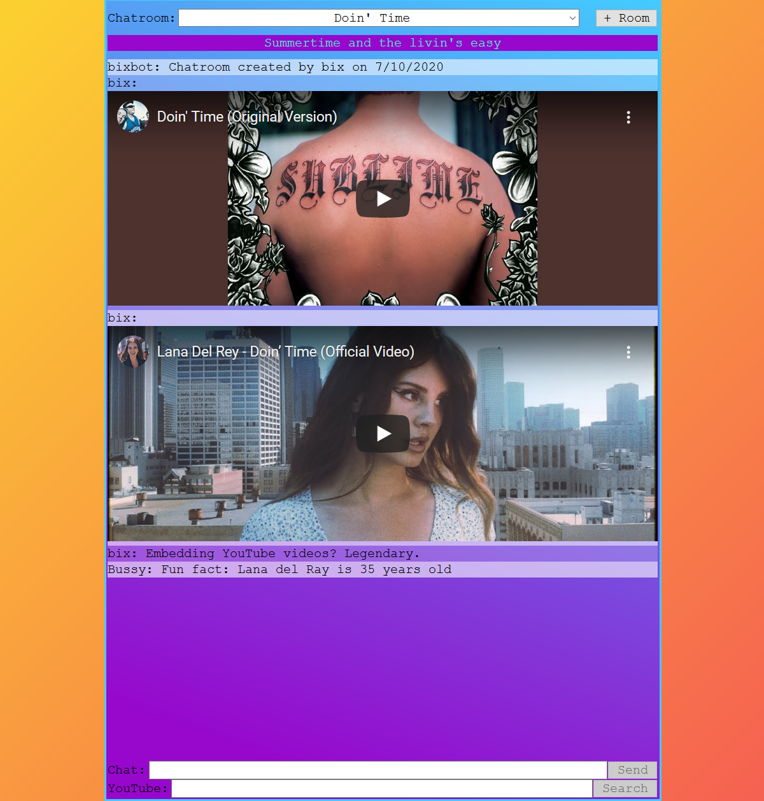

# Music Chat Worldwide!

## [Live Site](https://music-chat.now.sh)

## [API](https://github.com/bix6/music-chat-api)

## About

This is my first capstone for the Bloc.io webdev course.
I created a chat app to let friends and strangers share and discuss their favorite music.
The goal was to create an awesome place to share music online and learn about WebSockets.
Right now the app is simple but I have many features planned.

## Technology

This project is implemented using the PERN (PostgreSQL, Express, React, Node) stack and WebSockets (socket.io)

## Setup

- `mv example.env.local .env.local` and populate it
  - Only 1 set of endpoints should be used at a time; localhost for local dev and heroku for prod

## Screenshot

